# ⚙️ POST SYNTHESIS GLS

This documentation covers the post-synthesis functional validation of BabySoC, focusing on understanding Gate-Level Simulation (GLS) and Static Timing Analysis (STA). It guides you through performing synthesis, simulating the synthesized netlist, and validating the design’s functional correctness using OpenSTA for timing verification.

---

## 📑 Table of Contents

1. [Cloning the VSDBabySoC Repository](#1-cloning-the-vsdbabysoc-repository)
2. [Pre-Synthesis Simulation of BabySoC](#2pre-synthesis-simulation-of-babysoc)
3. [RTL Simulation Modules](#3rtl-simulation-modules)
4. [Simulating rvmythv--avsddacv--avsdpllv](#4simulating-rvmythv--avsddacv--avsdpllv)
5. [Post-Synthesis Simulation of BabySoC](#5post-synthesis-simulation-of-babysoc)
6. [Comparison](#6comparison)
7. [Summary](#7-summary)

---

# 1. Cloning the VSDBabySoC Repository

```bash
cd ~/home/meena/VLSI    #Navigate to the folder where you want to store your project
```

```bash
git clone https://github.com/manili/VSDBabySoC.git     #Clone the repository
cd VSDBabySoC
```

```bash
ls    #Check its contents
```

---

## 2.Pre-Synthesis Simulation of BabySoC

### Compile design with Icarus Verilog

```bash
mkdir -p output/pre_synth_sim    #Make a directory output to store the simulation files
iverilog -o /home/meena/VLSI/VSDBabySoC/output/pre_synth_sim/pre_synth_sim.out -DPRE_SYNTH_SIM -I /home/meena/VLSI/VSDBabySoC/src/include -I /home/meena/VLSI/VSDBabySoC/src/module /home/meena/VLSI/VSDBabySoC/src/module/testbench.v

```

### Run simulation & view waveforms

```bash
vvp /home/meena/VLSI/VSDBabySoC/output/pre_synth_sim/pre_synth_sim.out
gtkwave pre_synth_sim.vcd
```

**Waveform:**

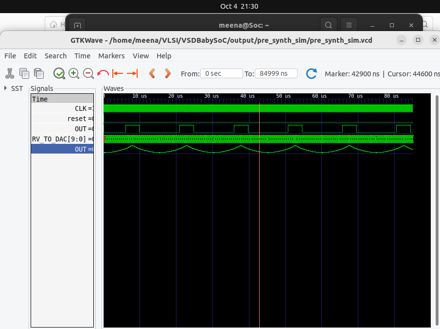

| **Signal** | **Direction** | **Source** | **Description** |
|-------------|---------------|-------------|-----------------|
| **CLK** | Input | PLL | Clock input to the RVMYTH core. Comes from the PLL. |
| **reset** | Input | External | Reset input to the RVMYTH core. Comes from an external source. |
| **RV_TO_DAC[9:0]** | Output | RVMYTH Register #17 | 10-bit output from RVMYTH that connects to the DAC. |
| **OUT (digital)** | Output | VSDBabySoC | Output of the VSDBabySoC module. Comes from DAC but behaves digitally in simulation. |
| **OUT (real)** | Wire (real) | DAC | Real-type wire representing the analog output of the DAC in simulation. |

>**NOTE**
>
>To view the output waveform in analog , right click `OUT`-> `Data format` -> `Analog` -> `Step`

**Reference**  
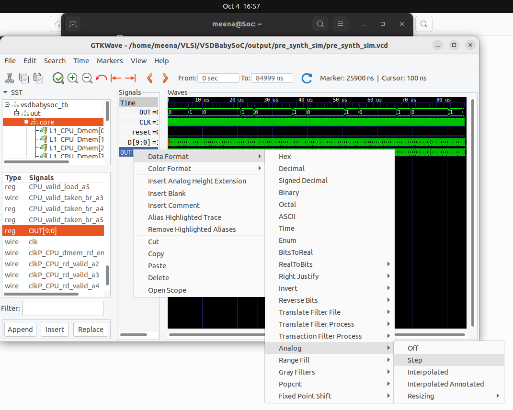

---

# 3.RTL Simulation Modules

### File structure

```ruby
VSDBabySoC/
├── LICENSE
├── Makefile
├── README.md
├── images/
    ├── centralized_avsddac.png
    ├── post_synth_sim.png
    ├── pre_synth_sim.png
    ├── rvmyth_layout.png
    ├── vsdbabysoc_block_diagram.png
    ├── centralized_avsddac.png  
|
└── src/
    ├── module/
    |   ├── avsddac.v
    |   ├── avsdpll.v
    |   ├── rvmyth.tlv
    |   └── vsdbabysoc.v
    ├── include/
    |   ├── sandpiper.vh
    |   ├── sandpiper_gen.vh
```


---

### 📂 Verilog Source Files (`*.v`)

<details>
<summary><strong>➡️ Example: DAC Module (`avsddac.v`)</strong></summary>

**Description:**  
Converts the **10-bit digital signal** from the RISC-V core into an analog output.


**Inputs:**
- `D` — 10-bit digital input from processor  
- `VREFH` — Reference voltage  

**Outputs:**
- `OUT` — Analog output  

</details>

<details>
<summary><strong>➡️ Example: PLL Module (`avsdpll.v`)</strong></summary>

**Description:**  
Generates a **stable clock** for synchronizing the RISC-V core and DAC.

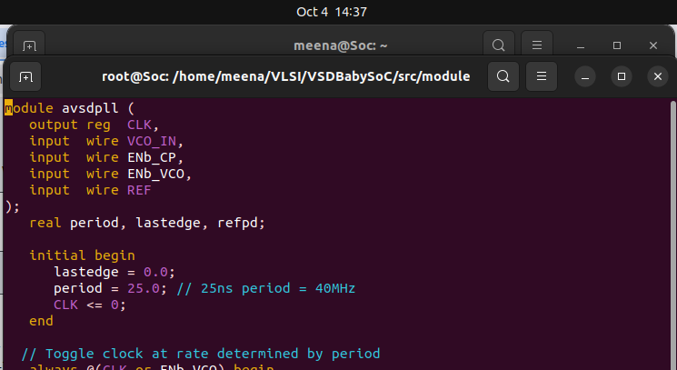

**Inputs:**
- `VCO_IN`, `ENb_CP`, `ENb_VCO`, `REF` — PLL control & reference signals  

**Outputs:**
- `CLK` — Stable clock output  

</details>

<details>
<summary><strong>➡️ Example: RISC-V Core (`rvmyth.v`)</strong></summary>

##### 🧩 TL-Verilog to Verilog Conversion 

**Install dependencies**

```bash
sudo apt install python3-venv python3-pip
python3 -m venv sp_env
source sp_env/bin/activate
pip3 install pyyaml click sandpiper-saas
```

>-**Ensure sp_env is activated**
>
>-source sp_env/bin/activate #To activate
>
>-deactivate #To deactivate

**Convert TL-Verilog → Verilog**

```bash
sandpiper-saas -i ./src/module/*.tlv -o rvmyth.v --bestsv --noline -p verilog --outdir ./src/module/
```   
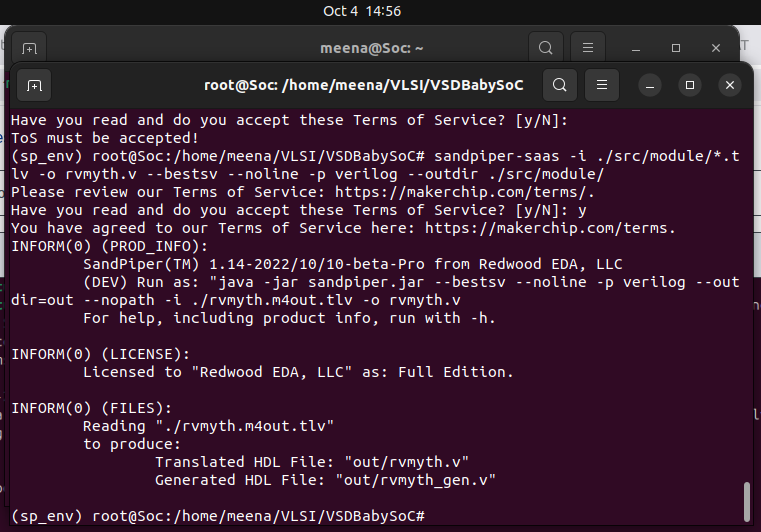

✅ Produces `rvmyth.v` and `rvmyth_gen.v`.

**Description:**  
Implements a **simple RISC-V processor** that produces a 10-bit digital signal for DAC conversion.

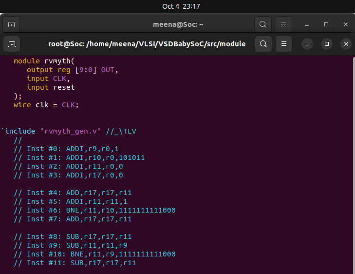

**Inputs:**
- `CLK` — Clock input from PLL  
- `reset` — Processor reset  

**Outputs:**
- `OUT` — 10-bit digital signal to DAC  
</details>
---

### 📂 Testbench (`testbench.v`)

The testbench:

* Provides **inputs** (`reset`, `REF`, etc.)
* Monitors **outputs** (`OUT`, `RV_TO_DAC`)
* Generates `.vcd` file for **waveform analysis**

---

# 4.Simulating `rvmyth.v` , `avsddac.v` , `avsdpll.v`

## rvmyth.v

**Testbench**
Make a new file in `/src/module` named `tb_rvmyth.v`

> Follow these steps:
>
> ```bash
> vim tb_rvmyth.v
> # press i to get into insert mode
> # paste the code and click 'Enter'
> :wq  # to write and save
> ```

**Testbench Code:**
```
`timescale 1ns / 1ps

module tb_rvmyth;
	// Inputs
	reg clk, reset;
	// Outputs
	wire [9:0] out;

        // Instantiate the Unit Under Test (UUT)
	rvmyth uut (
		.CLK(clk),
		.reset(reset),
		.OUT(out)
	);

	initial begin
        $dumpfile("tb_rvmyth.vcd");
        $dumpvars(0,tb_rvmyth);
        clk = 1;
        reset = 0;
        #2 reset = 1;
	#10 reset = 0;
        #2000 $finish;
        end
        always #1 clk = ~clk;

endmodule
```

**Synthesis**

```bash
vim tb_rvmyth.v   # Paste the testbench code
iverilog -o /home/meena/VLSI/VSDBabySoC/output/rvmyth/rvmyth.out -DPRE_SYNTH_SIM \
-I /home/meena/VLSI/VSDBabySoC/src/include -I /home/meena/VLSI/VSDBabySoC/src/module \
/home/meena/VLSI/VSDBabySoC/src/module/clk_gate.v \
/home/meena/VLSI/VSDBabySoC/src/module/rvmyth.v \
/home/meena/VLSI/VSDBabySoC/src/module/tb_rvmyth.v         #Simulation
vvp /home/meena/VLSI/VSDBabySoC/output/rvmyth/rvmyth.out     #Generating vcd file for output
```

**Waveform**

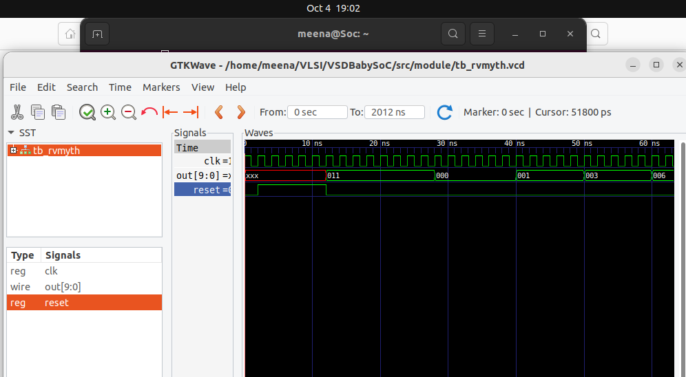

---

## avsddac.v

**Testbench**
Make a new file in `/src/module` named `tb_avsddac.v`

> Follow these steps:
>
> ```bash
> vim tb_avsddac.v
> # press i to get into insert mode
> # paste the testbench code and click 'Enter'
> :wq  # to write and save
> ```

**Testbench Code:**
```
`timescale 1ns / 1ps

module tb_avsddac;
reg EN;
reg real VREFH, VREFL;
reg [9:0] D;
wire real OUT;

avsddac uut ( .OUT(OUT), .D(D), .VREFH(VREFH), .VREFL(VREFL) );

initial begin

   EN = 1'b0;
#5 EN = 1'b1;

end
initial begin
   VREFH = 3.3;
   VREFL = 0.0;
end

initial begin 

#10  D = 10'h3FA;
#10  D = 10'h3FB;
#10  D = 10'h3FC;
#10  D = 10'h3FD;
#10  D = 10'h3FE;
#10  D = 10'h3FF;


end

initial begin
        $dumpfile("tb_avsddac.vcd");
        $dumpvars(0,tb_avsddac);
        //clk = 1;
        //reset = 0;
        //#2 reset = 1;
	//#10 reset = 0;
        #300 $finish;
        end
        
endmodule
```

**Synthesis**

```bash
vim tb_avsddac.v   # Paste the testbench code
iverilog -o /home/meena/VLSI/VSDBabySoC/output/avsddac/avsddac.out -DPRE_SYNTH_SIM \
-I /home/meena/VLSI/VSDBabySoC/src/include -I /home/meena/VLSI/VSDBabySoC/src/module \
/home/meena/VLSI/VSDBabySoC/src/module/clk_gate.v \
/home/meena/VLSI/VSDBabySoC/src/module/avsddac.v \
/home/meena/VLSI/VSDBabySoC/src/module/tb_avsddac.v
vvp /home/meena/VLSI/VSDBabySoC/output/avsddac/avsddac.out
```

### Waveform

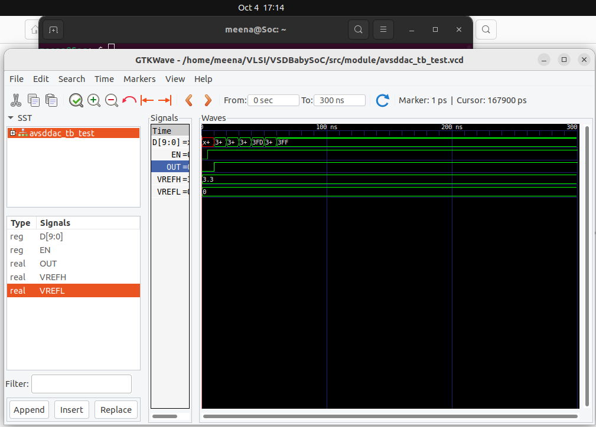

---

## avsdpll.v

**Testbench**
Make a new file in `/src/module` named `tb_avsdpll.v`

> Follow these steps:
>
> ```bash
> vim tb_avsdpll.v
> # press i to get into insert mode
> # paste the testbench code and click 'Enter'
> :wq  # to write and save
> ```

**Testbench code**  
```
module tb_pll();
   
    
  reg VSSD;
  reg EN_VCO;
 
  reg VSSA;
  reg VDDD;
  reg VDDA;
  reg VCO_IN;
  reg REF;
  reg c = 1'b1;
  wire CLK;


 avsdpll dut(.CLK(CLK), .VCO_IN(VCO_IN), .ENb_CP(c),.ENb_VCO(EN_VCO), .REF(REF));
  
  initial
   begin
   {REF,EN_VCO}=0;
   VCO_IN = 1'b0 ;
   VDDA = 1.8;
   VDDD = 1.8;
   VSSA = 0;
   VSSD = 0;
   
   end
   
   initial
 begin
    $dumpfile("tb_pll.vcd");
    $dumpvars(0,tb_pll);
 end
 
   initial
    begin
   // repeat(2)
  //begin
    // EN_VCO = 1;
    //#100 REF = ~REF;
     
    //end
 //repeat(2)
  //begin
    // EN_VCO = 1;
     //#50 REF = ~REF;

     //end

    repeat(400)
  begin
     EN_VCO = 1;
     #100 REF = ~REF;
     #(83.33/2)  VCO_IN = ~VCO_IN;
     
     end
     
      $finish;
    end
endmodule
```

**Synthesis**

```bash
vim tb_avsdpll.v   # Paste the testbench code
iverilog -o /home/meena/VLSI/VSDBabySoC/output/avsdpll/avsdpll.out -DPRE_SYNTH_SIM \
-I /home/meena/VLSI/VSDBabySoC/src/include -I /home/meena/VLSI/VSDBabySoC/src/module \
/home/meena/VLSI/VSDBabySoC/src/module/clk_gate.v \
/home/meena/VLSI/VSDBabySoC/src/module/avsdpll.v \
/home/meena/VLSI/VSDBabySoC/src/module/tb_avsdpll.v
vvp /home/meena/VLSI/VSDBabySoC/output/avsdpll/avsdpll.out
```

### Waveform

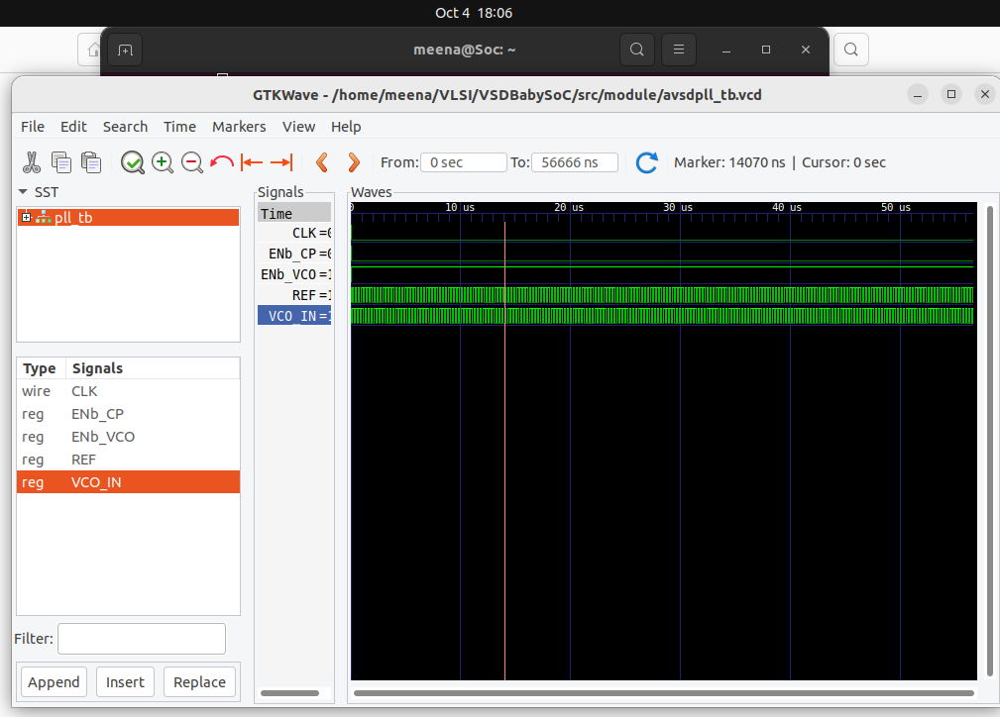

---

# 5.Post-Synthesis Simulation of BabySoC

Thes files need to be present in the working directory of `yosys` in order to ensure error free synthesis. This is done using the following commands,

```bash
cd ~/Documents/Verilog/Labs/VSDBabySoC
cp -r src/include/sp_verilog.vh .
cp -r src/include/sandpiper.vh .
cp -r src/include/sandpiper_gen.vh .
```

Now inside the `../VSDBabySoC` folder, run `yosys`.

```bash
yosys
```
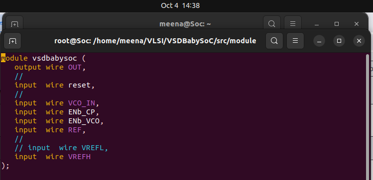

In `yosys`, perform the following commands to read the required verilog files.

```bash
read_verilog src/module/vsdbabysoc.v 
read_verilog -I /home/meena/VLSI/VSDBabySoC/src/include/ /home/meena/VLSI/VSDBabySoC/src/module/rvmyth.v
read_verilog -I /home/meena/VLSI/VSDBabySoC/src/include/ /home/meena/VLSI/VSDBabySoC/src/module/clk_gate.v
```

Then, the liberty files,

```bash
read_liberty -lib /home/meena/VLSI/VSDBabySoC/src/lib/avsdpll.lib 
read_liberty -lib /home/meena/VLSI/VSDBabySoC/src/lib/avsddac.lib 
read_liberty -lib /home/meena/VLSI/VSDBabySoC/src/lib/sky130_fd_sc_hd__tt_025C_1v80.lib
```

Synthesize `vsdbabysoc`, specifying it as the top module,

```bash
synth -top vsdbabysoc
```

Convert D Flip-Flops into equivalent Standard Cell instances by,

```bash
dfflibmap -liberty /home/meena/VLSI/VSDBabySoC/src/lib/sky130_fd_sc_hd__tt_025C_1v80.lib
```

Perform Optimization and Technology mapping using the following commands,

```bash
opt
abc -liberty /home/meena/VLSI/VSDBabySoC/src/lib/sky130_fd_sc_hd__tt_025C_1v80.lib -script +strash;scorr;ifraig;retime;{D};strash;dch,-f;map,-M,1,{D}
```

| Command        | Purpose                                                                     |
| -------------- | --------------------------------------------------------------------------- |
| `strash`       | Structural hashing — converts logic network to an AIG (And-Inverter Graph). |
| `scorr`        | Sequential redundancy removal — detects equivalent registers.               |
| `ifraig`       | Combinational equivalence simplification.                                   |
| `retime`       | Moves flip-flops for timing optimization.                                   |
| `{D}`          | Placeholder or marker for design partition (used internally by Yosys/ABC).  |
| `strash`       | Re-run structural hashing after retiming.                                   |
| `dch,-f`       | Performs combinational optimization (don’t-care-based).                     |
| `map,-M,1,{D}` | Maps the logic to gates in the provided `.lib` standard cell library.       |


Then, conduct final optimisations and clean-up through,

```bash
flatten
setundef -zero
clean -purge
rename -enumerate
```

Then finally write the netlist using,

```bash
write_verilog -noattr ~/Documents/Verilog/Labs/vsdbabysoc_synth.v
```

Compilation of the netlist with the testbench must be done, of course through `iverilog` using the following command,

```bash
iverilog -o ~/Documents/Verilog/Labs/vsdbabysoc_synth.vvp -DPOST_SYNTH_SIM -DFUNCTIONAL -DUNIT_DELAY=#1 -I ~/Documents/Verilog/Labs/VSDBabySoC/src/include -I ~/Documents/Verilog/Labs/VSDBabySoC/src/module -I  ~/Documents/Verilog/Labs/VSDBabySoC/src/gls_model ~/Documents/Verilog/Labs/VSDBabySoC/src/module/testbench.v
```

> [!Note]
> `-DPOST_SYNTH_SIM` | Defines the macro `POST_SYNTH_SIM` to enable post-synthesis simulation mode. \
> `-DFUNCTIONAL`     | Defines the macro `FUNCTIONAL` to select functional simulation mode. \      
> `-DUNIT_DELAY=#1`  | Defines the macro `UNIT_DELAY` with value `#1` for unit delay parameterization in simulation. 


Then, to view the waveform,

```bash
vvp vsdbabysoc_synth.vvp
gtkwave post_synth_sim.vcd 
```
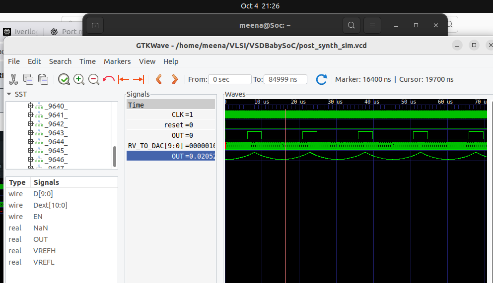

---

## 6.Comparison

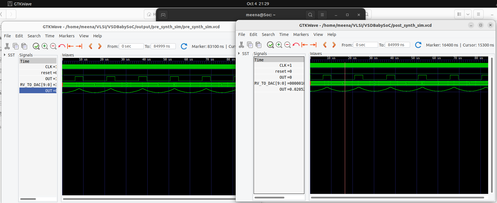

**✅ There is no mismatch between pre-synthesis and post-synthesis simulation**

---

## 7. Summary

* BabySoC integrates a **RISC-V CPU, PLL, and DAC**.
* Functional simulation validates design before synthesis.
* Using **Icarus Verilog + GTKWave**, we verified CPU → DAC interaction.
* This provides a practical introduction to **SoC functional modeling**.
