# 🧠 Week 3 – OpenSTA Timing Analysis and Automation (Innovative Workflow)

## 🔍 Overview
This week’s focus is on performing **Static Timing Analysis (STA)** using **OpenSTA** with Docker, Liberty files, and gate-level netlists — combined with **our innovation** of automating min/max delay analysis across different PVT corners for the **VSDBabySoC** project.

## 📚 Table of Contents

- [🧠 Week 3 – OpenSTA Timing Analysis and Automation (Innovative Workflow)](#-week-3--opensta-timing-analysis-and-automation-innovative-workflow)
  - [🔍 Overview](#-overview)
  - [⚙️ Step 1: Git Clone and Setup](#️-step-1-git-clone-and-setup)
  - [🧩 Example 1 – Basic Timing Analysis](#-example-1--basic-timing-analysis)
  - [⚡ Synthesis and Netlist Verification (Yosys Flow)](#-synthesis-and-netlist-verification-yosys-flow)
  - [🧮 SPEF-Based Analysis](#-spef-based-analysis)
  - [📊 Detailed Reports](#-detailed-reports)
  - [💡 Automated Min/Max Delay Calculation](#-automated-minmax-delay-calculation)
  - [🧱 VSDBabySoC Custom STA](#-vsdbabysoc-custom-sta)
  - [⚠️ Common Errors & Fixes](#️-common-errors--fixes)
  - [🌡️ Advanced: STA Across PVT Corners](#️-advanced-sta-across-pvt-corners)
  - [📦 External Resource for Library Files](#-external-resource-for-library-files)
  - [⏱️ Timing Graphs](#️-timing-graphs)
  - [🧠 Key Takeaways](#-key-takeaways)

---

## ⚙️ Step 1: Git Clone and Setup

```bash
git clone https://github.com/parallaxsw/OpenSTA.git
cd OpenSTA/
```

### 🐳 Install Docker
```bash
sudo apt update
sudo apt install docker
```

**Note:** Docker group requires root or user with docker group access.

### Build the Docker Image
```bash
sudo docker build --file Dockerfile.ubuntu22.04 --tag opensta .
```  
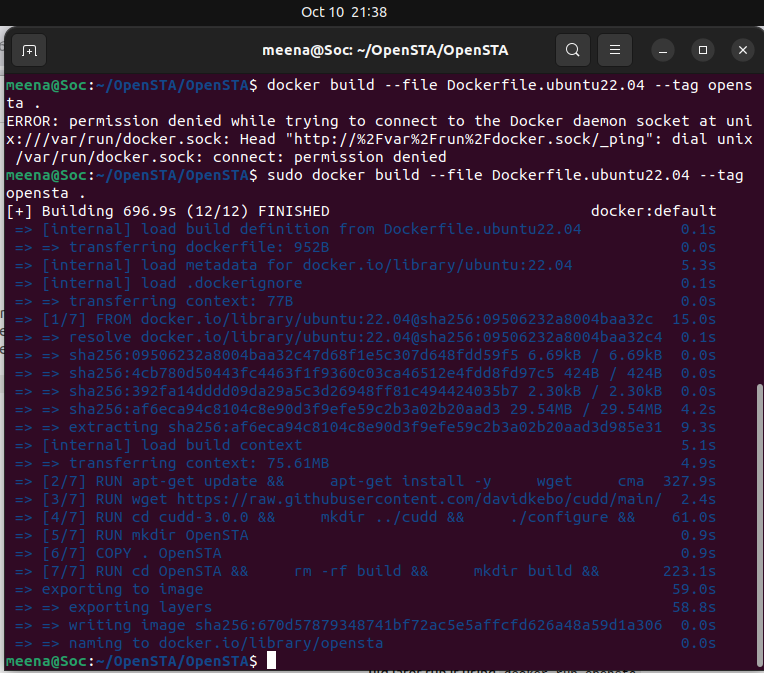

**Error Fix Tip:**  
If you face this error:
```
permission denied while trying to connect to the Docker daemon socket
```
Use:
```bash
sudo usermod -aG docker $USER
sudo systemctl restart docker
```

### Run the OpenSTA Shell
```bash
sudo docker run -i -v $HOME:/data opensta
```  
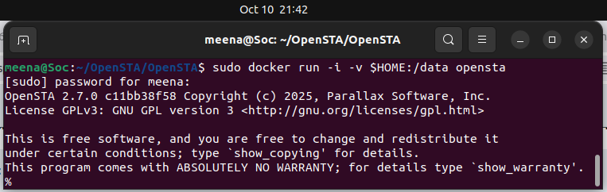

---

## 🧩 Example 1 – Basic Timing Analysis

**Script**
```tcl
read_liberty /OpenSTA/examples/nangate45_slow.lib.gz
read_verilog /OpenSTA/examples/example1.v
link_design top
create_clock -name clk -period 10 {clk1 clk2 clk3}
set_input_delay -clock clk 0 {in1 in2}
report_checks
```

**Sample Report**
The delays through the cells can be compared by openSTA shell's report_timing
```
Startpoint: r2 (FF)
Endpoint: r3 (FF)
Slack (MET): 9.43 ns
```
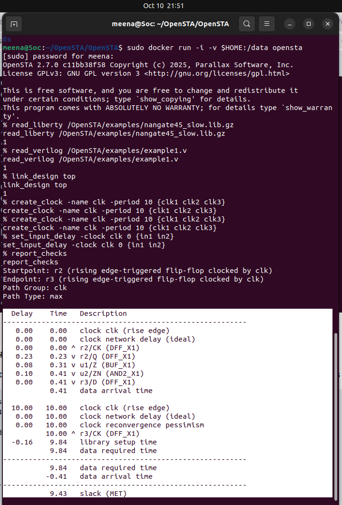

---

## ⚡ Synthesis and Netlist Verification (Yosys Flow)

```bash
gunzip -k nangate45_slow.lib.gz
gunzip -k nangate45_fast.lib.gz
```

**In yosys:**
```bash
read_liberty -lib nangate45_slow.lib
read_verilog example1.v
synth -top top
show
```  
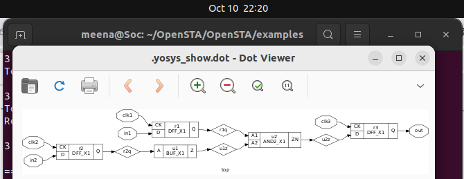

**Output:**
```
=== top ===
Cells:
  AND2_X1 : 1
  BUF_X1  : 1
  DFF_X1  : 3
```

---

## 🧮 SPEF-Based Analysis

This analysis is done for the parasitic delay due to capacitor , resistor ,etc..

```bash
sudo docker run -i -v $HOME:/data opensta
```

**Script**
```tcl
read_liberty /OpenSTA/examples/nangate45_slow.lib.gz
read_verilog /OpenSTA/examples/example1.v
link_design top
read_spef /OpenSTA/examples/example1.dspef
create_clock -name clk -period 10 {clk1 clk2 clk3}
set_input_delay -clock clk 0 {in1 in2}
report_checks
```


Result shows parasitic delay effects, lowering slack due to net capacitance.

---

## 📊 Detailed Reports

### 1️⃣ Capacitance Report
```tcl
report_checks -digits 4 -fields capacitance 
```
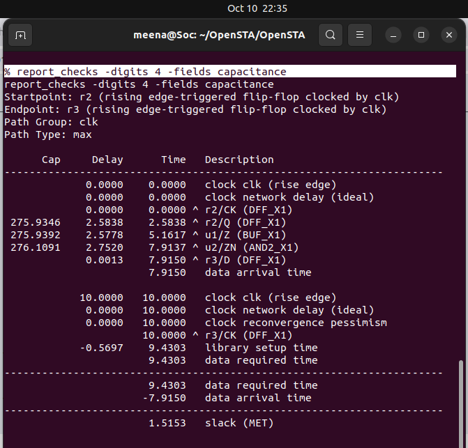


### 2️⃣ Slew & Fanout Report
```tcl
report_checks -digits 4 -fields [list capacitance slew input_pins fanout]
```   
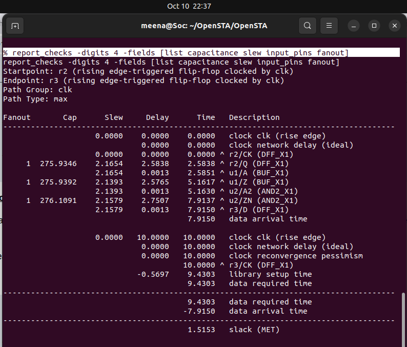

### 3️⃣ Power Report
```tcl
report_power
```  
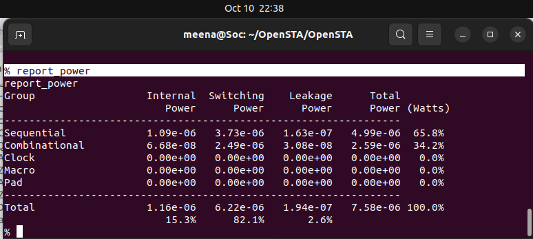

### 4️⃣ Pulse Width Report
```tcl
report_pulse_width_checks
```  
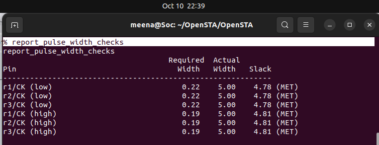

### 5️⃣ Units Check
```tcl
report_units
```  
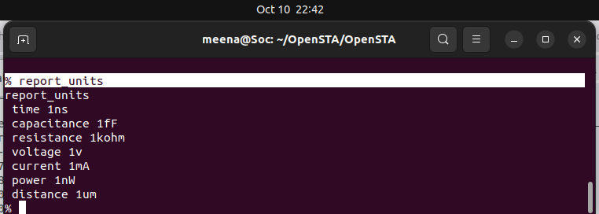


---

## 💡 Automated Min/Max Delay Calculation

We automated OpenSTA’s flow via a TCL script to simplify multi-lib and multi-path delay verification.

**min_max_delays.tcl**
```tcl
read_liberty -max /data/OpenSTA/OpenSTA/examples/nangate45_slow.lib.gz
read_liberty -min /data/OpenSTA/OpenSTA/examples/nangate45_fast.lib.gz
read_verilog /data/OpenSTA/OpenSTA/examples/example1.v
link_design top
create_clock -name clk -period 10 {clk1 clk2 clk3}
set_input_delay -clock clk 0 {in1 in2}
report_checks -path_delay min_max
```

_**Note:** You should mention the read_liberty and read_verilog file as with location_

**Run Command**
```bash
sudo docker run -it -v $HOME:/data opensta /data/OpenSTA/OpenSTA/examples/min_max_delays.tcl
```  

**Generated Report**  
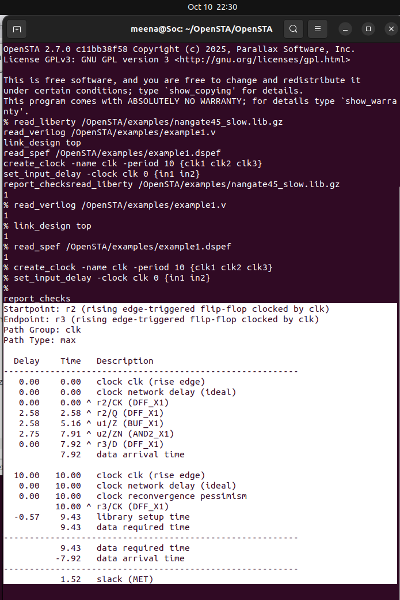 

---

## 🧱 VSDBabySoC Custom STA

### Directory Setup
```bash
mkdir -p examples/timing_libs/
mkdir -p examples/BabySoC/
```

**Need of these files :**
```
**Standard cell library:** sky130_fd_sc_hd__tt_025C_1v80.lib #/home/meena/VLSI/VSDBabySoC/src/lib

**IP-specific Liberty libraries:** avsdpll.lib, avsddac.lib #/home/meena/VLSI/VSDBabySoC/src/lib

**Synthesized gate-level netlist:** vsdbabysoc.synth.v #/home/meena/VLSI/VSDBabySoC/src/module

**Timing constraints:** vsdbabysoc_synthesis.sdc #/home/meena/VLSI/VSDBabySoC/src/sdc
```

**File Paths**
|Folder|Files|
|------|-----|
|`timing_libs`|`avsddac.lib`,`avsdpll.lib`,`sky130_fd_sc_hd__tt_025C_1v80.lib`|
|`BabySoC`|`vsdbabysoc.synth.v`,`vsdbabysoc_synthesis.sdc`,`gcd_sky130hd.sdc`|

## vsdbabysoc_min_max_delays.tcl
```tcl
read_liberty -min /data/OpenSTA/OpenSTA/examples/timing_libs/sky130_fd_sc_hd__tt_025C_1v80.lib
read_liberty -max /data/OpenSTA/OpenSTA/examples/timing_libs/sky130_fd_sc_hd__tt_025C_1v80.lib

read_liberty -min /data/OpenSTA/OpenSTA/examples/timing_libs/avsdpll.lib
read_liberty -max /data/OpenSTA/OpenSTA/examples/timing_libs/avsdpll.lib

read_liberty -min /data/OpenSTA/OpenSTA/examples/timing_libs/avsddac.lib
read_liberty -max /data/OpenSTA/OpenSTA/examples/timing_libs/avsddac.lib

read_verilog /data/OpenSTA/OpenSTA/examples/BabySoC/vsdbabysoc.synth.v
link_design vsdbabysoc
read_sdc /data/OpenSTA/OpenSTA/examples/BabySoC/vsdbabysoc_synthesis.sdc

report_checks -path_delay min_max
```

**Run Command**
```bash
sudo docker run -it -v /home/meena:/data opensta /data/OpenSTA/OpenSTA/examples/BabySoC/vsdbabysoc_min_max_delays.tcl
```

---

## ⚠️ Common Errors & Fixes

### ❌ Liberty Syntax Error
Error:
```
/avsdpll.lib line 54, syntax error
```
Fix:
Replace from line 54 with:
```liberty
/* pin (GND#2) {
   direction : input;
   max_transition : 2.5;
   capacitance : 0.001;
} */
pin (VDD) {
   direction : input;
   max_transition : 2.5;
   capacitance : 0.001;
}
```

---

## 🌡️ Advanced: STA Across PVT Corners

---

## 📦 External Resource for library files 

**Liberty Library Download:**
[https://github.com/efabless/skywater-pdk-libs-sky130_fd_sc_hd/tree/master/timing](https://github.com/efabless/skywater-pdk-libs-sky130_fd_sc_hd/tree/master/timing)

```bash
git clone https://github.com/efabless/skywater-pdk-libs-sky130_fd_sc_hd.git
cd skywater-pdk-libs-sky130_fd_sc_hd/timing
```  
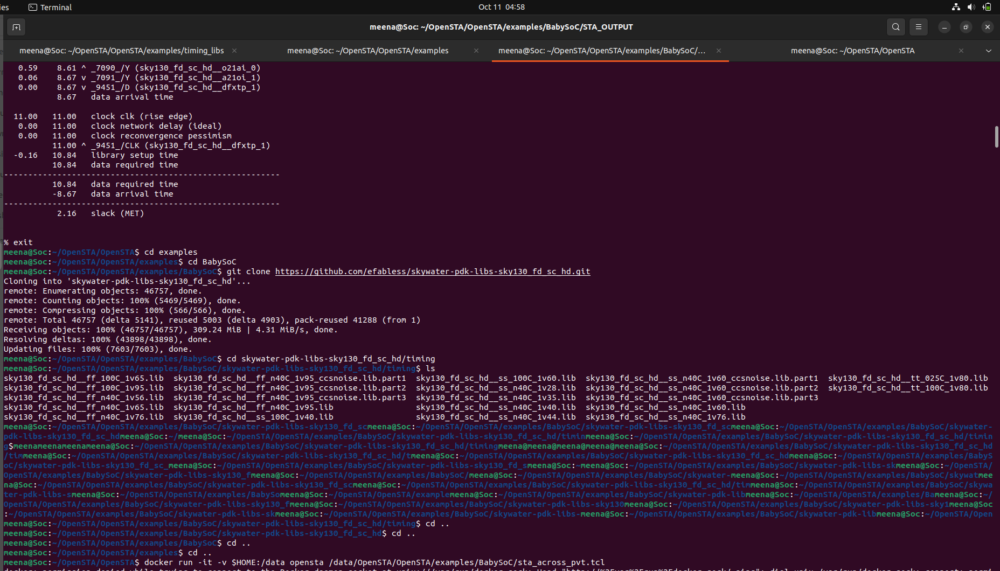   

## sta_across_pvt.tcl
```tcl
# List of Liberty files for different PVT corners
set list_of_lib_files {
    "sky130_fd_sc_hd__tt_025C_1v80.lib"
    "sky130_fd_sc_hd__ff_100C_1v65.lib"
    "sky130_fd_sc_hd__ff_100C_1v95.lib"
    "sky130_fd_sc_hd__ff_n40C_1v56.lib"
    "sky130_fd_sc_hd__ff_n40C_1v65.lib"
    "sky130_fd_sc_hd__ff_n40C_1v76.lib"
    "sky130_fd_sc_hd__ss_100C_1v40.lib"
    "sky130_fd_sc_hd__ss_100C_1v60.lib"
    "sky130_fd_sc_hd__ss_n40C_1v28.lib"
    "sky130_fd_sc_hd__ss_n40C_1v35.lib"
    "sky130_fd_sc_hd__ss_n40C_1v40.lib"
    "sky130_fd_sc_hd__ss_n40C_1v44.lib"
    "sky130_fd_sc_hd__ss_n40C_1v76.lib"
}
# Read common timing libraries
read_liberty /data/OpenSTA/OpenSTA/examples/timing_libs/avsdpll.lib
read_liberty /data/OpenSTA/OpenSTA/examples/timing_libs/avsddac.lib

foreach lib_file $list_of_lib_files {

    read_liberty /data/OpenSTA/OpenSTA/examples/BabySoC/skywater-pdk-libs-sky130_fd_sc_hd/timing/$lib_file
    read_verilog /data/OpenSTA/OpenSTA/examples/BabySoC/vsdbabysoc.synth.v
    link_design vsdbabysoc
    current_design
    read_sdc /data/OpenSTA/OpenSTA/examples/BabySoC/vsdbabysoc_synthesis.sdc
    check_setup -verbose

    report_checks -path_delay min_max -fields {nets cap slew input_pins fanout} -digits 4 \
        > /data/OpenSTA/OpenSTA/examples/BabySoC/STA_OUTPUT/min_max_$lib_file.txt

    exec echo "$lib_file" >> /data/OpenSTA/OpenSTA/examples/BabySoC/STA_OUTPUT/sta_worst_max_slack.txt
    report_worst_slack -max -digits 4 >> /data/OpenSTA/OpenSTA/examples/BabySoC/STA_OUTPUT/sta_worst_max_slack.txt

    exec echo "$lib_file" >> /data/OpenSTA/OpenSTA/examples/BabySoC/STA_OUTPUT/sta_worst_min_slack.txt
    report_worst_slack -min -digits 4 >> /data/OpenSTA/OpenSTA/examples/BabySoC/STA_OUTPUT/sta_worst_min_slack.txt

    exec echo "$lib_file" >> /data/OpenSTA/OpenSTA/examples/BabySoC/STA_OUTPUT/sta_tns.txt
    report_tns -digits 4 >> /data/OpenSTA/OpenSTA/examples/BabySoC/STA_OUTPUT/sta_tns.txt

    exec echo "$lib_file" >> /data/OpenSTA/OpenSTA/examples/BabySoC/STA_OUTPUT/sta_wns.txt
    report_wns -digits 4 >> /data/OpenSTA/OpenSTA/examples/BabySoC/STA_OUTPUT/sta_wns.txt

}
``` 

**Running the script**  
```
 sudo docker run -it -v /home/meena:/data opensta /data/OpenSTA/OpenSTA/examples/BabySoC/sta_across_pvt.tcl
```

**ERROR :**
This could be solved by setting up the input and output delay ports properly at `vsdbabysoc_synthesis.sdc`
```
Warning: There are 6 input ports missing set_input_delay.
  ENb_CP
  ENb_VCO
  REF
  VCO_IN
  VREFH
  reset
Warning: There is 1 output port missing set_output_delay.
  OUT
Warning: There are 2 unconstrained endpoints.
  OUT
  _9607_/D
```

## SDC file changes:
```
set_units -time ns
create_clock -name clk -period 11 [get_pins {pll/CLK}]
set_max_delay 10 -from [get_clocks clk] -to [get_ports {OUT}]
set_input_delay -clock clk -max 2.0 [get_ports {ENb_CP ENb_VCO REF VCO_IN VREFH reset}]
set_output_delay -clock clk -max 2.0 [get_ports {OUT}]
set_false_path -to [get_ports {OUT}]
```

## min/max delay lib text files after .tcl

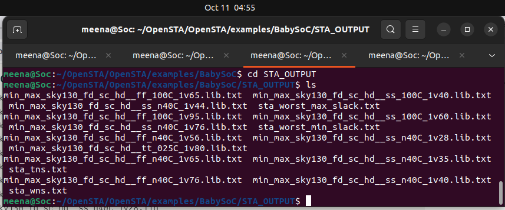

## ⏱️ Timing Graphs  

**After generating min/max delay lib files , generate the timing graphs using the following commands**
```
report_checks -path_delay max -n_paths 5 -format dot > sta_tns.dot #Inside the OpenSTA shell, after linking and clock/delay setup
dot -Tpng sta_tns.dot -o sta_tns.png  #Then render it with Graphviz
```

▶ STA – TNS (Total Negative Slack)

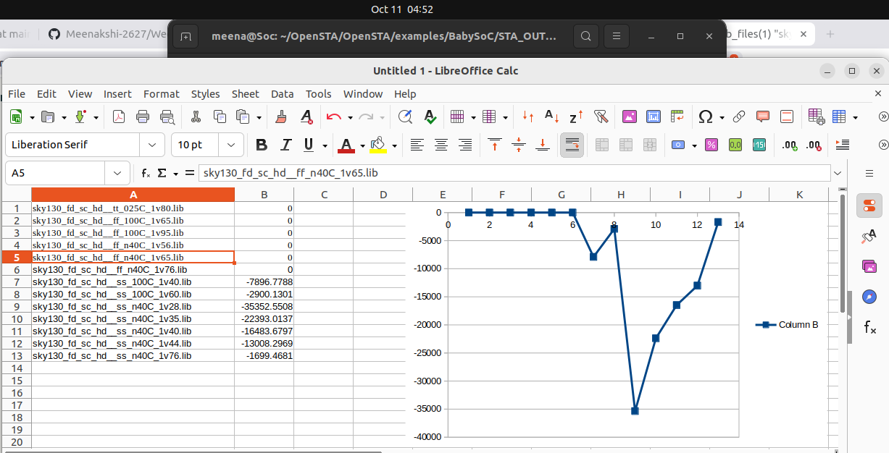


▶ STA – WNS (Worst Negative Slack)

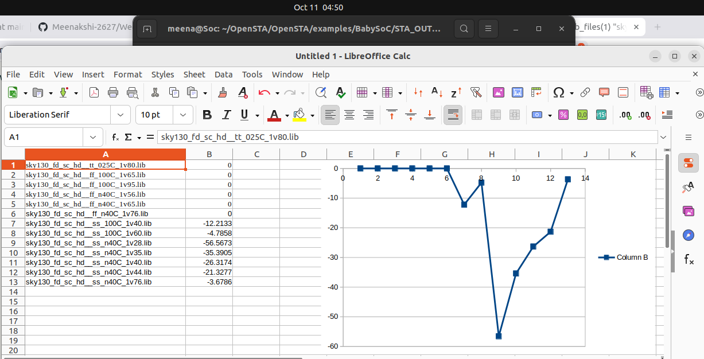


▶ STA – Worst Min Slack

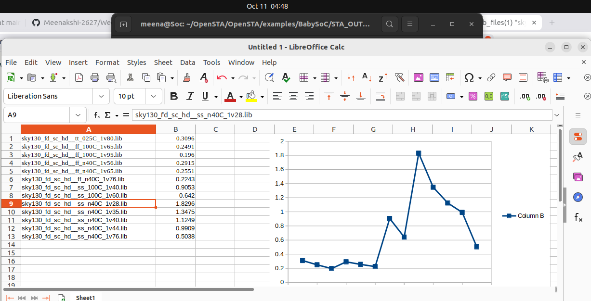


▶ STA – Worst Max Slack

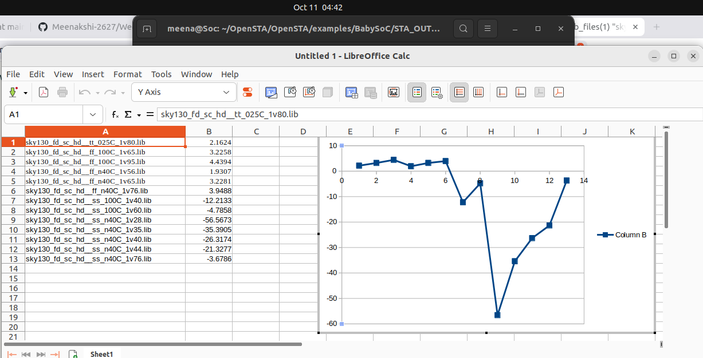

